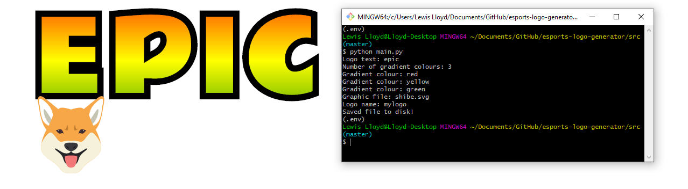

# esports-logo-generator

Generate logos in the style of esports franchises.

**Very much a work-in-progress**.



## Getting Started

### Prerequisites

Python 3 (with pip):
```
https://www.python.org/downloads/
```

### Installing

Install the required packages:

```
$ pip install -r requirements.txt
```

Run the script:

```
$ cd src/

$ python main.py
```

The script will output an svg to the current directory.

## Testing

// TODO.

## Extras

### Built With

* [svgwrite](https://pypi.org/project/svgwrite/) - A Python library to create SVG drawings.

### Authors

* **Lewis Lloyd** (GitHub: [LloydTao](https://github.com/LloydTao), Twitter: [LloydTao](https://twitter.com/LloydTao))

See also the list of [contributors](https://github.com/LloydTao/esports-logo-generator/contributors) who participated in this project.

---

This project is licensed under the MIT License - see the [LICENSE.md](LICENSE.md) file for details.
